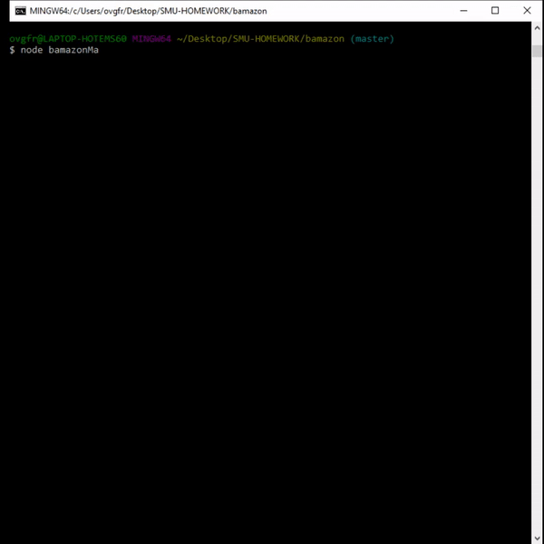

<h3 align="center">Bamazon</h3>

  <p align="center">
    This is a node application using MySQL as a database to replicate the interactions between the customer, manager, or supervisor with a stores inventory and profits. 
    <br />
    <a href="https://github.com/fred-h-nguyen/bamazon"><strong>Explore the docs »</strong></a>
    <br />
    <br />
    <a href="https://github.com/fred-h-nguyen/bamazon/issues">Report Bug</a>
  </p>


<!-- TABLE OF CONTENTS -->
## Table of Contents

* [About the Project](#about-the-project)
  * [Built With](#built-with)
* [Getting Started](#getting-started)
  * [Prerequisites](#prerequisites)
  * [Installation](#installation)
* [Usage](#usage)
* [Roadmap](#roadmap)
* [Contributing](#contributing)
* [Contact](#contact)


<!-- ABOUT THE PROJECT -->
## About The Project
### Built With

* Javascript
* Node.js
* npm-MySQL
* npm-inquirer


<!-- GETTING STARTED -->
## Getting Started

To get a local copy up and running follow these simple steps.

### Prerequisites

This is an example of how to list things you need to use the software and how to install them.
* npm
```sh
npm install npm@latest -g
```

### Installation
 
1. Clone the repo
```sh
git clone https:://github.com/fred-h-nguyen/bamazon.git
```
2. Install NPM packages
```sh
npm install
```


<!-- USAGE EXAMPLES -->
## Usage

* This is how the customer uses application to interact with the store and buy an item.


* When there is not enough stock for the customer to buy.


* Manager using the application to interact with the inventory of the items like check for low inventory and adding inventory.


* Manager using the application to add a new product to the list.



* Supervisor checking the profits.


* Supervisor adding a new department to the store.


<!-- ROADMAP -->
## Roadmap

See the [open issues](https://github.com/fred-h-nguyen/bamazon/issues) for a list of proposed features (and known issues).


<!-- CONTRIBUTING -->
## Contributing

Contributions are what make the open source community such an amazing place to be learn, inspire, and create. Any contributions you make are **greatly appreciated**.

1. Fork the Project
2. Create your Feature Branch (`git checkout -b feature/AmazingFeature`)
3. Commit your Changes (`git commit -m 'Add some AmazingFeature'`)
4. Push to the Branch (`git push origin feature/AmazingFeature`)
5. Open a Pull Request

<!-- CONTACT -->
## Contact

Fred Nguyen - fred-h-nguyen@gmail.com

Project Link: [https://github.com/fred-h-nguyen/bamazon](https://github.com/fred-h-nguyen/bamazon)